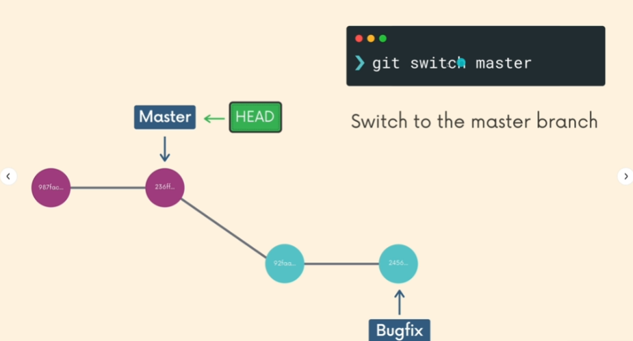
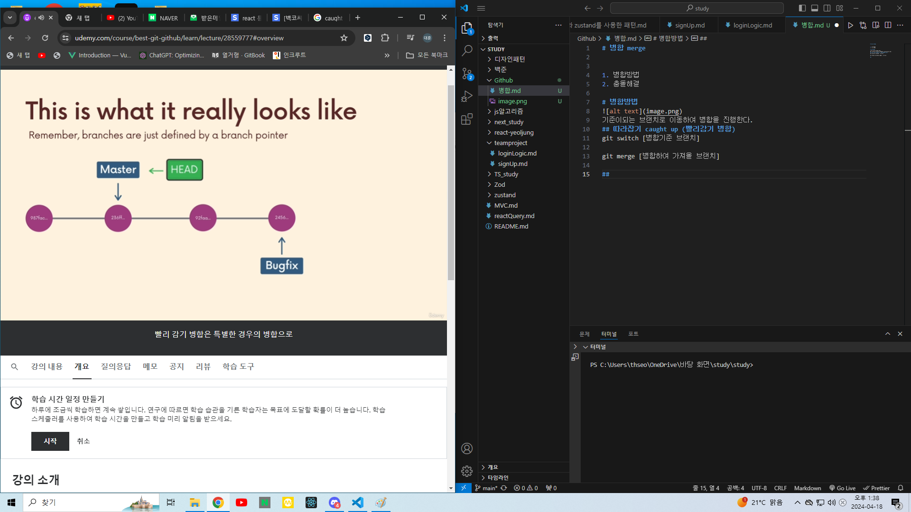
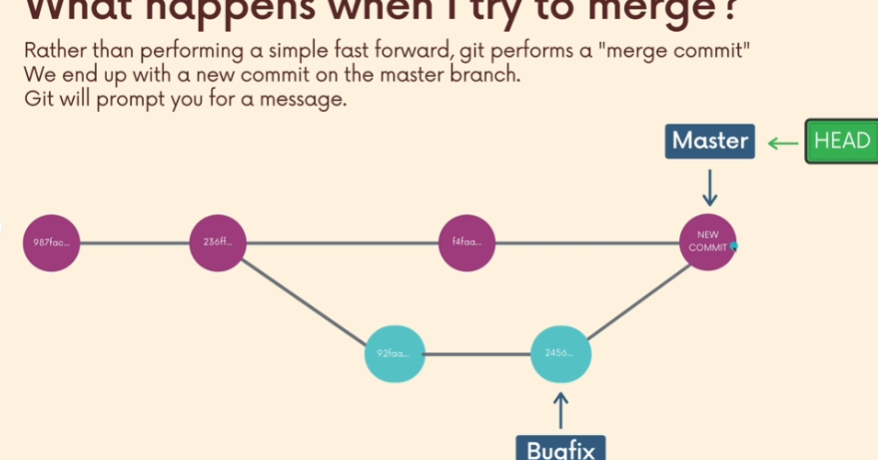
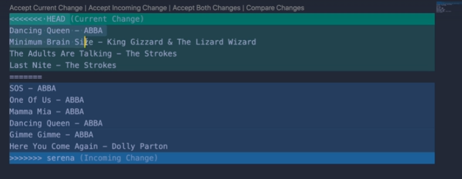
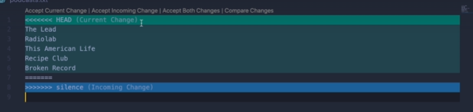

# 병합 merge

1. 병합방법
2. 충돌해결

# 병합방법

  
기준이되는 브랜치로 이동하여 병합을 진행한다.

## 따라잡기 caught up (빨리감기 병합)

git switch [병합기준 브랜치]

git merge [병합하여 가져올 브랜치]

그림에 보이는 버그픽스 브랜치와 마스터를 병합해서 마스터를 버그픽스로 만든다

마스터가 버그픽스를 따라잡는다.

## 병합 커밋

2명이 한팀이라면 두개의 브랜치가 있다.
병합시에 두개의 다른 부모 커밋을 갖는다.

# 병합시 충돌이 발생했을 때!

HEAD는 기준이되는 브랜치에 있던 정보
====밑에는 새로 merge될 정보들
add 후 커밋
푸시

# vs코드를 이용한 충돌방지

병합시 여러옵션이 나온다.
