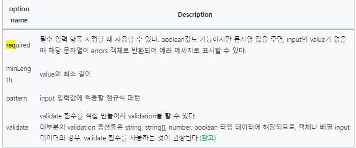

# Zod

## Zod는 왜 사용하는가?

1. TypeScript는 런타임 과정에서의 타입에러를 잡을 수 없고 컴파일 단계만 잡을 수 있다.
2. TypeScript는 원하는 숫자 범위를 강제하거나 number타입의 정수/실수의 구분이 불가능하다.

## 스키마

```.js
import { z } from "zod";

const Man = z.object({
  name: z.string(),
  height: z.number(),
  age: z.number(),
  phoneNum: z.string(),
  homePhoneNum: z.string().optional(),
  isCompletedMilitaryService: z.boolean(),
});
```

### 스키마 생성

기본 ⇒ `z.{type}`

```.js
import { z } from "zod";

// primitive values
z.string();
z.number();
z.bigint();
z.boolean();
z.date();
z.symbol();

// object
z.object({
  username: z.string()
});

// array
z.array(z.string())
z.string().array() // 💡BMS프로젝트 컨벤션!

// function
z.function();

// empty types
z.undefined();
z.null();
z.void(); // accepts undefined

// catch-all types
// allows any value
z.any();
z.unknown();

// never type
// allows no values
z.never();
```

## 파싱

```.js
import { z } from "zod";

// 'string' 스키마 생성
const mySchema = z.string();

// 기본 파싱 => 타입이 일치하지 않으면 에러
mySchema.parse("tuna"); // => "tuna"
mySchema.parse(12); // => throws ZodError

// "safe"파싱 => 유효성 검사 실패 시에도 오류를 발생시키지 않음.
mySchema.safeParse("tuna"); // => { success: true; data: "tuna" }
mySchema.safeParse(12); // => { success: false; error: ZodError }
```

1. parse() : 스키마를 기준으로 데이터의 유효성 확인
2. parseAsync() : 비동기 정제를 사용하는 경우 parseAsync를 사용해야 함
3. safeParse() : 유효성 검사에 실패해도 오류를 던지지 않음.
4. safeParseAsync() : safeParse의 비동기버전. 편의상 .spa() 로도 사용 가능.

## 간단한 사용법

```.js
import { z } from "zod";

const User = z.object({
  username: z.string(),
});

User.parse({ username: "Ludwig" });

// extract the inferred type
type User = z.infer<typeof User>;
// { username: string }
```

## Zod는 react-hook-form과 통합이 가능하다.

간단한 예제 코드.

```.js
'use client';
import { useForm } from 'react-hook-form';
import { zodResolver } from '@hookform/resolvers/zod';
import * as z from 'zod';

const schema = z.object({
  name: z.string().min(1, { message: 'Required' }),
  age: z.number().min(10),
});

const ZodComponent = () => {
  const {
    register,
    handleSubmit,
    formState: { errors },
  } = useForm({
    resolver: zodResolver(schema),
  });

  return (
    <form
      onSubmit={handleSubmit((d) => console.log(d))}
      className=" border border-slate-500  bg-slate-400"
    >
      <h2>ZodComponent</h2>
      <input {...register('name')} />
      <input type="number" {...register('age', { valueAsNumber: true })} />
      <input type="submit" />
    </form>
  );
};

export default ZodComponent;
```

https://articles.wesionary.team/react-hook-form-schema-validation-using-zod-80d406e22cd8

### 훅폼과 같이쓰기

```.js

const validationSchema = z
  .object({
    firstName: z.string().min(1, { message: "Firstname is required" }),
    lastName: z.string().min(1, { message: "Lastname is required" }),
    email: z.string().min(1, { message: "Email is required" }).email({
      message: "Must be a valid email",
    }),
    password: z
      .string()
      .min(6, { message: "Password must be atleast 6 characters" }),
    confirmPassword: z
      .string()
      .min(1, { message: "Confirm Password is required" }),
    terms: z.literal(true, {
      errorMap: () => ({ message: "You must accept Terms and Conditions" }),
    }),
  })
  .refine((data) => data.password === data.confirmPassword, {
    path: ["confirmPassword"],
    message: "Password don't match",
  });
```

위 코드에서 `z.string().min(1, { message: "Firstname is required" }),`
이 부분은

먼저 문자열인지 확인한 후 입력데이터가 한글자 이상인지 확인한다. 유효성 검사 메서드를 사용할때 추가 인수를 제공하여 오류 메시지를 띄웁니다.

```.js
const Form = () => {
  const {
    register,
    handleSubmit,
    formState: { errors },
  } = useForm<ValidationSchema>({
    resolver: zodResolver(validationSchema),  //결과값에 타입을 줬다?
  });

  const onSubmit: SubmitHandler<ValidationSchema> = (data) => console.log(data);
}

```

보면 도움되는 영상 : https://youtu.be/cc_xmawJ8Kg


